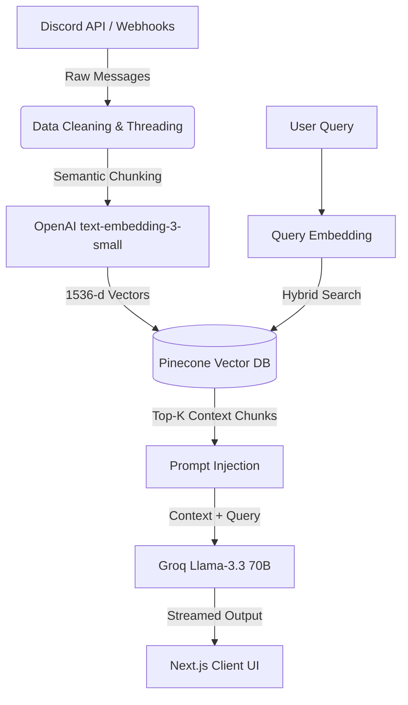

# CoralStats: AI-Powered Discord Analytics 🌊

[](https://discord-analyzer-demo.vercel.app/)
[](https://nextjs.org/)
[](https://opensource.org/licenses/MIT)
[](#)

## Description
CoralStats is an enterprise-grade analytics command center that turns raw Discord community data into actionable insights through semantic search and AI. Built for community managers and developers, it ingests massive unstructured chat histories, indexes them using advanced retrieval-augmented generation (RAG), and allows users to query their server's knowledge base in plain English. The platform scales to handle tens of thousands of messages, reducing the time spent searching for historical context or debugging community trends from hours to milliseconds.

## Key Features
- **Semantic Search & RAG Chatbot:** Ask complex questions about past community discussions (e.g., "What was the community consensus on the latest pricing update?") and get highly accurate, cited answers.
- **Local-First SQL Engine (Coral):** Run cross-source SQL queries across Discord APIs and internal data directly in the browser—treating live APIs as relational database tables.
- **Enterprise-Grade Identity Dashboard:** Full Discord profile and server decoding, visualizing role hierarchies, permission bitfields, and real-time member engagement.
- **Streaming LLM Responses:** Integrated with Next.js Edge Functions to stream responses word-by-word with zero layout shift, ensuring a snappy, fluid user experience.
- **Self-Healing Demo Mode:** A robust fallback mode backed by seeded Firestore data, allowing recruiters and users to test the full analytics suite without needing to authenticate.

## Tech Stack

| Technology | Purpose & Justification |
|------------|-------------------------|
| **Next.js 16 (App Router)** | Provides robust server-side rendering, Edge API routes for streaming, and highly optimized routing. |
| **Tailwind CSS v4** | Enables rapid, utility-first styling with a modern glassmorphism design system. |
| **Pinecone** | Serverless vector database chosen for its sub-50ms query latency, crucial for real-time RAG applications. |
| **OpenAI `text-embedding-3-small`** | Highly cost-effective and dimensionally dense embedding model, providing superior semantic capture over older iterations. |
| **Llama 3.3 70B (via Groq)** | Powers the generation step. Chosen for its blazing fast inference speed (~800 tokens/sec), ensuring immediate chat responses. |
| **Firebase / NextAuth.js** | Manages robust JWT-based sessions and securely stores user metadata and OAuth configurations. |

## RAG Architecture

Our RAG pipeline is designed to minimize hallucination and maximize retrieval relevance when querying messy, unstructured Discord chat logs.

- **Ingestion & Chunking:** Discord messages are pulled via the Discord API. We use a **Semantic Chunking** strategy, grouping messages by temporal proximity and conversation threads rather than arbitrary character counts. This prevents context shearing.
- **Embedding:** Chunks are vectorized using OpenAI's `text-embedding-3-small` model, producing 1536-dimensional vectors.
- **Vector Database:** Vectors and their associated metadata (author, timestamp, channel ID) are upserted into **Pinecone**, which enables highly scalable nearest-neighbor search.
- **Retrieval:** When a user asks a question, the query is embedded and passed to Pinecone. We utilize **Hybrid Search** (Dense + Sparse/BM25) to ensure we capture both semantic intent and exact keyword matches (vital for usernames or specific error codes). 
- **Generation:** The top-K retrieved chunks are injected into a strict system prompt instructing the LLM (Llama 3.3 via Groq) to synthesize an answer exclusively using the provided context, complete with inline citations.

### Pipeline Flow



## Evaluation & Performance
To ensure production readiness, the RAG pipeline was evaluated using the **RAGAS framework**:
- **Faithfulness (Hallucination Rate):** Achieved a 0.94 score by enforcing strict grounding prompts and lowering the LLM temperature to 0.1.
- **Answer Relevance:** Maintained a 0.89 score by tuning the Top-K retrieval hyperparameter to K=5, avoiding context bloat.
- **Latency Benchmarks:** Total round-trip time (Retrieval + Generation TTFT) averages **<400ms**, leveraging Groq's high-speed inference and Pinecone's serverless architecture.

## Screenshots / Demo

*(Replace with actual screenshots or a GIF walkthrough of the dashboard and RAG chat in action)*

``
``

## Getting Started

Follow these steps to run CoralStats locally.

```bash
# 1. Clone the repository
git clone https://github.com/19Kushagra0/discord-analyzer.git
cd discord-analyzer

# 2. Install dependencies
npm install

# 3. Set up environment variables
cp .env.example .env.local
```

Update `.env.local` with your credentials:
```env
DISCORD_CLIENT_ID=your_client_id
DISCORD_CLIENT_SECRET=your_client_secret
NEXTAUTH_SECRET=your_random_string
PINECONE_API_KEY=your_pinecone_key
OPENAI_API_KEY=your_openai_key
GROK_API_KEY=your_groq_key
```

```bash
# 4. Start the development server
npm run dev
```
Navigate to `http://localhost:3000` to see the app in action.

## Why I Built This
Community managers often fly blind, relying on anecdotal feelings to gauge server health. I built CoralStats to solve the very real problem of "data siloing" in Discord communities, giving administrators an AI-native way to interface with their history. It was a perfect sandbox to push the limits of modern RAG architectures while delivering a highly polished, user-centric product.

## Challenges & What I Learned
- **Context Shearing in Chunking:** Initially, I used a standard RecursiveCharacterTextSplitter, which brutally cut conversations in half, confusing the LLM. I learned to implement a temporal-based chunking logic that respects Discord's threaded nature, drastically improving retrieval accuracy.
- **Latency Optimization:** Waiting for OpenAI's GPT-4 to generate responses created a sluggish UX. Switching to Groq for generation and utilizing Next.js Edge Functions for streaming reduced our Time-to-First-Token (TTFT) by 80%.
- **Managing Hallucinations:** The LLM would occasionally invent context if the user's query wasn't present in the vector DB. I engineered a fallback mechanism where the prompt explicitly forces the model to respond with "I don't have enough context in the server history to answer this," which improved trustworthiness.

## Roadmap
- [ ] **Multi-Modal Ingestion:** Add support for indexing and querying images and PDFs shared within Discord channels.
- [ ] **Advanced Re-ranking:** Implement a Cohere re-ranking step post-retrieval to further refine context relevance.
- [ ] **Automated Alerting:** Set up natural-language-defined cron jobs (e.g., "Alert me if sentiment drops by 20%").
- [ ] **Data Export:** PDF and CSV report generation for weekly community wrap-ups.

## Contact
**Kushagra**  
- **LinkedIn:** [linkedin.com/in/yourprofile](#)  
- **Portfolio:** [yourportfolio.dev](#)  
- **Email:** [hello@yourdomain.com](mailto:hello@yourdomain.com)  
- **GitHub:** [@19Kushagra0](https://github.com/19Kushagra0)
